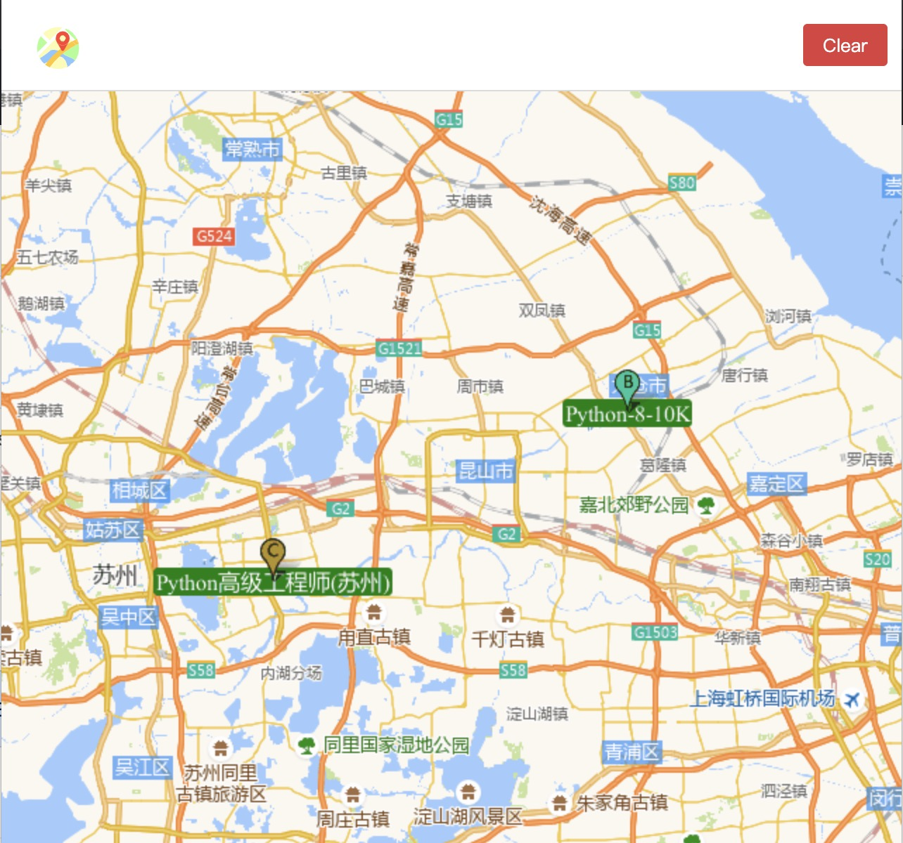

# Boring chrome extension-program

## BiliFans.chrome

> 超 🐔 简单的 Bilibili 粉丝数显示 chrome 插件！


## Usage

输入 spaceid

**如何获取 spaceid ?**

> 打开 bilibili 的个人空间

```js
"https://space.bilibili.com/14036737/#/";
//                         |________|
//                             ||
//                       这串数字就是辣。
```

**点击扩展栏图标还可以重新设置 `spaceid`**


---
## AutoMarkJob.chrome

> 自动在地图上标注查看过的职位位置 🤖️！

**在查看具体职位内容后才会捕捉到其职位的位置并在地图标记出来。**


## 支持的网站

- boss 直聘

由于 chrome 插件和地图 API 的限制，很多想要的功能没有实现 😭。
